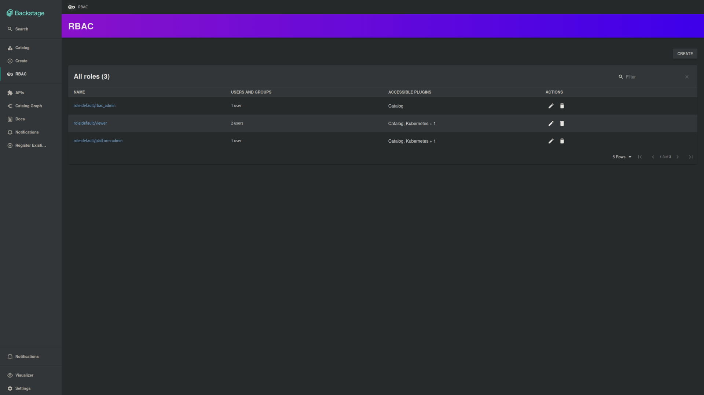

# Deploying Backstage on Kubernetes

A fork-and-run local Kubernetes environment for Backstage on KinD, provisioned by Terraform and continuously reconciled by ArgoCD, with Envoy Gateway for ingress.



## Prerequisites

Install [Docker](https://docs.docker.com/get-docker/), [KinD](https://kind.sigs.k8s.io/docs/user/quick-start/#installation), [Terraform](https://developer.hashicorp.com/terraform/downloads) (>= 1.5), [Helm](https://helm.sh/docs/intro/install/) (>= 3), and [kubectl](https://kubernetes.io/docs/tasks/tools/).

## One-time GitHub setup

1. Fork the repo.
2. Clone your fork, not the upstream repository. For future fork-based projects, clone your fork the usual way.
3. Create and install the GitHub App with the [operator setup guide](docs/operator/github-app-setup.md).
4. Copy the Terraform variables example:

   ```bash
   cp terraform/terraform.tfvars.example terraform/terraform.tfvars
   ```

5. Fill `terraform/terraform.tfvars` with the GitHub App credentials; the downloaded .pem file and terraform/terraform.tfvars are gitignored.

## Boot the cluster

On a fresh fork, the Backstage image has not been published to your GHCR yet. Run the build once before applying:

```bash
gh workflow run "Build Backstage Image" --repo <your-user>/backstage-k8s-full
gh run watch --repo <your-user>/backstage-k8s-full
```

The build pushes the image to your fork's GHCR and commits a tag bump to `deploy/dev/backstage.yaml` on `main`. After it finishes:

1. Open `https://github.com/users/<your-user>/packages/container/backstage-k8s-full%2Fbackstage/settings` and change visibility to Public. KinD has no GHCR pull secret, so a private package causes `ImagePullBackOff`.
2. Pull the bump commit into your working tree:

   ```bash
   git pull --ff-only
   ```

Then run Terraform:

```bash
cd terraform && terraform apply
```

Wait for ArgoCD to finish syncing.

Open <http://backstage.localtest.me>. You'll see Backstage through the local Envoy Gateway.

## Verify it's working

Check Backstage through the Gateway:

```bash
curl -fsS --retry 10 --retry-delay 3 --retry-connrefused --retry-all-errors \
  http://backstage.localtest.me | grep -q '<title>'
```

Retrieve the ArgoCD admin password:

```bash
kubectl -n argocd get secret argocd-initial-admin-secret \
  -o jsonpath='{.data.password}' | base64 -d && echo
```

Open <http://backstage.localtest.me> and confirm the Guest and GitHub sign-in buttons are visible.

## What's next

- Use [operator operations](docs/operator/operations.md) for syncs, credential rotation, common commands, and image verification.
- Run the [manual RBAC demo](docs/operator/manual-rbac-demo.md) to check Guest and GitHub permissions.
- Prepare for local Backstage source builds with the [developer setup guide](docs/developer/backstage-development.md).

See [ADR-0001](docs/adr/0001-kind-terraform-envoy-gateway.md) for the KinD + Terraform + Envoy Gateway rationale.

## Try the platform

- Build your own image: edit `hello-world/index.html` and, if desired, `hello-world/Dockerfile`. In Backstage, scaffold an Application with Source type set to Container image and point it at `hello-world/`. The scaffolder wires a caller workflow that uses `.github/workflows/build-image.yaml`; the image lands in GHCR and Argo CD picks it up.
- Deploy a third-party chart: scaffold an Application with Source type set to Helm chart and use `oci://ghcr.io/stefanprodan/charts/podinfo` as the chart reference. This exercises the umbrella-chart discovery path described in [ADR-0009](docs/adr/0009-kubernetes-discovery-by-template-ownership.md).

These smoke tests are intentionally scaffolded instead of shipped pre-installed; see [ADR-0010](docs/adr/0010-decommission-starter-workloads.md) for the rationale.
