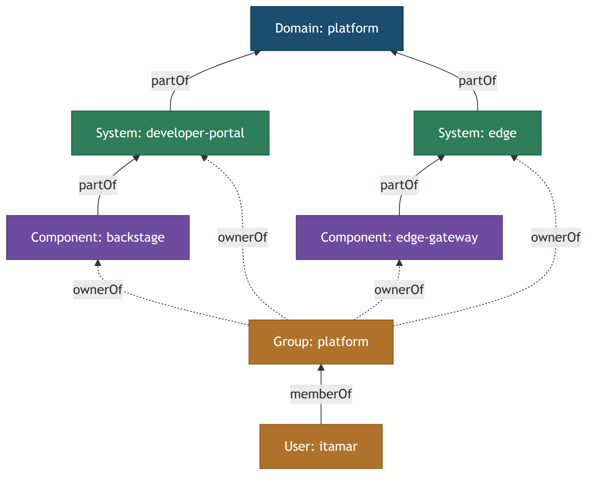
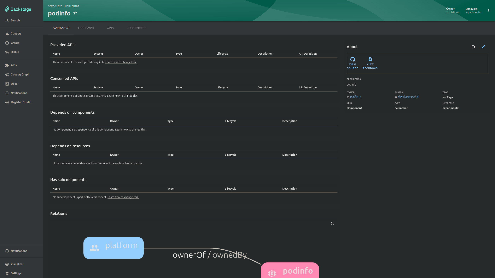
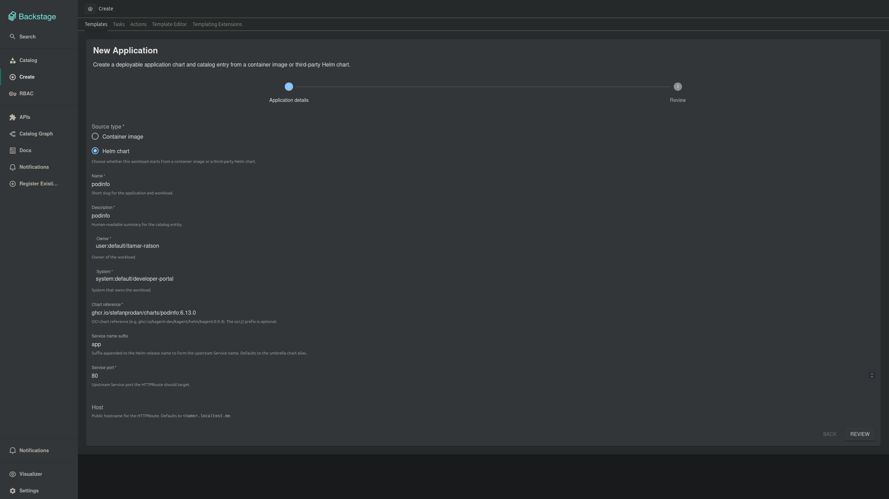
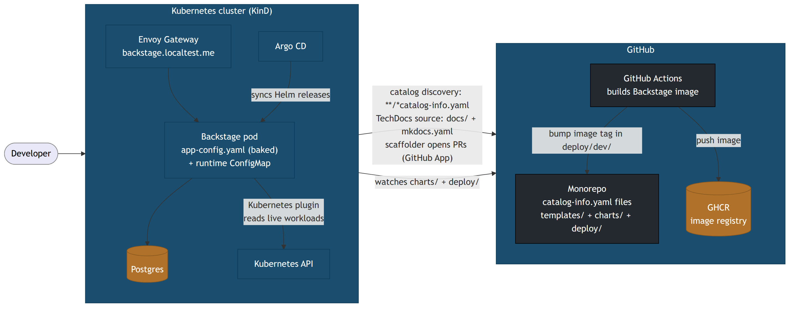

# Backstage Is a Framework, Not a Product

*The mental model the getting-started guide never gives you: the catalog, the scaffolder, TechDocs, and the plugin architecture, shown against a real deployment.*


The official Backstage tutorial ends at the worst possible moment.

You run `npx @backstage/create-app`, wait for yarn to do its thing, run `yarn dev`, and a handsome developer portal appears at `localhost:3000`. Success! Then you click around. The catalog contains a few example entities. The Create page has one demo template. The docs tab renders some placeholder text. And the guide is… over. You are left staring at an empty portal with no idea what you were supposed to put in it, or why.

Here's the thing the guide never says out loud: **Backstage is not an app you install. It's a TypeScript framework you adopt.** That `create-app` command didn't give you a product. It generated a monorepo that *you now own*: a React frontend, a Node backend, a yarn workspace, and a plugin system. Everything you'll actually use it for (cataloging services, scaffolding new ones, hosting docs, enforcing access) is a subsystem you have to understand, configure, and in places extend with your own code.

That reframing changes how you evaluate it, how you budget for it, and whether you should adopt it at all.

This post walks through the four subsystems that make up "Backstage core," in the order they depend on each other: the **catalog**, the **scaffolder**, **TechDocs**, and the **plugin architecture** underneath all of it. Instead of toy examples, every claim links to a working open-source platform that runs Backstage on Kubernetes with Argo CD, real templates, custom scaffolder actions, RBAC, and TechDocs, so you can see each concept in a file that actually runs: [backstage-k8s-full](https://github.com/Itamar-Ratson/backstage-k8s-full). All links are pinned to a specific commit, so they'll still be accurate when the repo moves on.

At the end, one diagram shows where each of the four concepts physically lands in a real deployment, and then we'll answer the question the whole post builds toward: should your team adopt this?

---

## 1. The catalog is a data model, not a list of services

The catalog is the part everyone thinks they understand ("it's a service inventory"), and that misunderstanding is why so many Backstage rollouts stall. The catalog is a **graph data model**. Getting value out of Backstage means populating that graph and keeping it true.

Every node in the graph is an *entity*, declared in a YAML file that lives in a git repo. Here is a complete, real one, the Envoy gateway component from the evidence repo:

```yaml
apiVersion: backstage.io/v1alpha1
kind: Component
metadata:
  name: edge-gateway
  description: Envoy Gateway providing HTTP routing and TLS termination at the cluster edge.
  annotations:
    backstage.io/kubernetes-id: edge-gateway
spec:
  type: gateway
  lifecycle: production
  owner: platform
  system: edge
```

*Full file: [charts/platform/edge-gateway/catalog-info.yaml](https://github.com/Itamar-Ratson/backstage-k8s-full/blob/fd482225f8f210445d3d541e97c6321b815fa598/charts/platform/edge-gateway/catalog-info.yaml)*

Three things in those 13 lines carry almost all of the catalog's design:

**Kinds.** `Component` is one of about nine entity kinds. The ones you'll touch first: `Component` (a piece of software), `System` (a group of components that deliver something together), `Domain` (a business area grouping systems), `API`, `Resource` (infrastructure like a database), `Group` and `User` (your org chart), and `Template` (scaffolder templates are catalog entities too; remember that for section 2).

**Relations.** `spec.owner: platform` and `spec.system: edge` aren't display strings; they're edges. The catalog resolves them into a graph: the component is `partOf` a system, the system is `partOf` a domain, a group is `ownerOf` all of it, users are `memberOf` groups. This graph is what you're actually building:



That graph is queryable and, more importantly, *renderable*. Here's what Backstage shows on a component page, generated purely from those YAML relations:



**Annotations.** `backstage.io/kubernetes-id` does nothing by itself. It's an integration point: the Kubernetes plugin reads it to find the component's live workloads and show pods on the component page. Annotations are how the catalog becomes the join table for every other plugin: TechDocs, CI, alerts, and dashboards all hang off annotations. This is the mechanism that makes the catalog the center of gravity of the whole portal.

The second thing the official guide undersells: **how entities get into the catalog**. Clicking "Register existing component" and pasting a URL is the demo path, and it does not scale past a dozen services. The real mechanism is *locations and discovery*: you point the catalog at a pattern, and it continuously ingests whatever matches. The evidence repo does it with a single glob:

```yaml
catalog:
  locations:
    - type: url
      target: https://github.com/${GITHUB_OWNER}/${GITHUB_REPO}/blob/main/**/*catalog-info.yaml
```

*In context: [deploy/dev/backstage.yaml](https://github.com/Itamar-Ratson/backstage-k8s-full/blob/fd482225f8f210445d3d541e97c6321b815fa598/deploy/dev/backstage.yaml)*

Drop a `catalog-info.yaml` anywhere in the repo, and the entity appears in the portal a few minutes later. No clicks, no registration ceremony. At org scale you'd use the GitHub discovery provider across hundreds of repos, but the principle is identical: **the catalog is ingested from git, continuously. Git is the source of truth; the portal is a projection of it.**

**What this costs you:** the catalog is only as good as your organization's willingness to maintain it. Every `owner:` must name a real team, every `lifecycle:` must be honest, and stale entries poison trust in the whole portal; a catalog that's 80% accurate gets treated as 0% trustworthy. Budget for ownership hygiene as an ongoing practice, not a one-time import.

---

## 2. The scaffolder is the reason you're doing this

If the catalog is Backstage's noun, the scaffolder is its verb, and it's the feature that justifies the whole adoption. The pitch: a developer fills in a form and gets a new service with a repo, CI, deployment manifests, and a catalog entry. Your platform team's best practices, baked in by default, every time. The industry calls these *golden paths*.



A template is a YAML file with three parts: **parameters** (a JSON-Schema-driven form definition; the screenshot above is rendered entirely from it), **steps** (a pipeline of actions), and **output** (links to show when it's done). Here are the steps of the evidence repo's application template, trimmed to the skeleton:

```yaml
steps:
  - id: defaults
    name: Resolve platform defaults
    action: platform:resolve-repo-url        # custom action

  - id: fetchImageTemplate
    name: Fetch image template
    action: fetch:template                    # built-in
    input:
      url: ./skeleton/image
      targetPath: charts/workloads/${{ parameters.name }}

  - id: publishImagePullRequest
    name: Publish image pull request
    action: publish:github:pull-request       # built-in
    input:
      repoUrl: ${{ steps.defaults.output.repoUrl }}
      branchName: scaffold/application/${{ parameters.name }}
```

*Full template: [templates/application/template.yaml](https://github.com/Itamar-Ratson/backstage-k8s-full/blob/fd482225f8f210445d3d541e97c6321b815fa598/templates/application/template.yaml)*

Two design decisions in there deserve your attention, because they're the ones the official docs bury.

**First: actions are pluggable TypeScript, and you will write your own.** `fetch:template` and `publish:github:pull-request` ship with Backstage. But `platform:resolve-repo-url` does not. It's a custom action defined in the repo's backend, about fifty lines. Here's the shape of one (this action parses an OCI Helm chart reference into the fields a Helm dependency needs):

```typescript
export function createParseOciRefAction() {
  return createTemplateAction({
    id: 'platform:parse-oci-ref',
    description: 'Parses a full OCI chart reference into Helm dependency fields.',
    schema: {
      input: { ref: z => z.string() },
      output: {
        chart: z => z.string(),
        repository: z => z.string(),
        version: z => z.string(),
      },
    },
    async handler(ctx) {
      const parsed = parseOciRef(ctx.input.ref);
      ctx.output('chart', parsed.chart);
      ctx.output('repository', parsed.repository);
      ctx.output('version', parsed.version);
    },
  });
}
```

*Full file: [parseOciRef.ts](https://github.com/Itamar-Ratson/backstage-k8s-full/blob/fd482225f8f210445d3d541e97c6321b815fa598/backstage/packages/backend/src/actions/platform/parseOciRef.ts) · registered in [module.ts](https://github.com/Itamar-Ratson/backstage-k8s-full/blob/fd482225f8f210445d3d541e97c6321b815fa598/backstage/packages/backend/src/actions/platform/module.ts)*

A typed schema, a handler, an output. That's the entire extension model, and it's the moment Backstage stops being configuration and starts being *your* software. Any golden path worth having encodes platform decisions ("images come from our GHCR namespace," "repos are named like this") that no built-in action can know. Custom actions are where those decisions live.

**Second: notice what the template *doesn't* do.** It doesn't deploy anything. The final step opens a pull request. A human merges it; Argo CD notices the new Helm chart in the repo and deploys it. The scaffolder composes beautifully with GitOps precisely because its output is *files in git*, not API calls to a cluster. Backstage never needs deploy credentials, every scaffolded service goes through code review, and the whole flow is auditable in git history. If you're already running Argo CD or Flux, this is the integration pattern to steal.

**What this costs you:** templates and actions are a software product that you own. They have bugs, they need tests (the evidence repo runs [contract tests against its templates](https://github.com/Itamar-Ratson/backstage-k8s-full/blob/fd482225f8f210445d3d541e97c6321b815fa598/backstage/packages/backend/src/template-contract.test.ts) plus a suite of scaffold-and-render shell tests in CI), and every change to your platform conventions means updating them. Budget real, recurring TypeScript engineering time, not a one-off setup sprint.

---

## 3. TechDocs: docs live with code, render in the portal

TechDocs is the least glamorous of the four systems and the one with the best effort-to-value ratio. The idea is *docs-as-code*: documentation is Markdown in the same repo as the software it documents, built with [MkDocs](https://www.mkdocs.org/), and rendered inside the portal on the component's own page.

Wiring a component into TechDocs takes exactly two things. One annotation on the entity:

```yaml
metadata:
  annotations:
    backstage.io/techdocs-ref: dir:.
```

…and an `mkdocs.yaml` next to the code:

```yaml
INHERIT: ../../shared-mkdocs-base.yml
site_name: Edge Gateway
docs_dir: docs
nav:
  - Home: index.md
  - Namespace Opt-In: namespace-opt-in.md
```

*Full file: [charts/platform/edge-gateway/mkdocs.yaml](https://github.com/Itamar-Ratson/backstage-k8s-full/blob/fd482225f8f210445d3d541e97c6321b815fa598/charts/platform/edge-gateway/mkdocs.yaml)*

That `INHERIT` line is a trick worth stealing: every component's docs config inherits one [shared base file](https://github.com/Itamar-Ratson/backstage-k8s-full/blob/fd482225f8f210445d3d541e97c6321b815fa598/shared-mkdocs-base.yml) that pins the theme, the Mermaid diagram plugin, and the Markdown extensions. Individual components declare only their name and nav. Uniform docs across the platform, one file to change when standards evolve.

Why does docs-next-to-code matter enough to be one of the four core systems? Because the alternative, the wiki, fails the same way the manually-registered catalog fails: it decays silently. Docs that live in the repo travel through the same pull requests as the code they describe, get reviewed by the same people, and appear in the portal on the page a developer is *already looking at* when they need them. TechDocs' whole contribution is removing every excuse for the wiki.

One production note the official guide genuinely does cover, but everyone skips: TechDocs has a `builder` setting. The evidence repo uses `builder: 'local'` (the Backstage pod builds docs on demand), which is fine for a lab and simple deployments. At scale you switch to the *external* pattern: CI builds the docs and publishes them to object storage (S3/GCS), and Backstage just serves them. Decide early; retrofitting is annoying.

**What this costs you:** TechDocs is plumbing, not content. It makes good docs *cheap*, but it cannot make them *exist*; that's a culture problem, and a portal full of empty docs tabs is worse than no docs tab at all. There's also a small toolchain tax: MkDocs is Python, so your Backstage image (or CI) now carries a Python toolchain alongside Node.

---

## 4. Everything is a plugin, including the parts you think are core

Here is the architectural fact that explains everything else about Backstage: **the catalog, the scaffolder, and TechDocs (the "core features" from the last three sections) are plugins.** The same plugin system you'd use to add something exotic is what assembles the basics. The app `create-app` gave you is a nearly-empty shell, and the backend is literally a list of plugin registrations. This is the evidence repo's backend, lightly trimmed:

```typescript
const backend = createBackend();

// scaffolder
backend.add(import('@backstage/plugin-scaffolder-backend'));
backend.add(import('@backstage/plugin-scaffolder-backend-module-github'));
backend.add(scaffolderPlatformActionsModule); // the custom actions from section 2

// techdocs
backend.add(import('@backstage/plugin-techdocs-backend'));

// auth
backend.add(import('@backstage/plugin-auth-backend'));
backend.add(import('@backstage/plugin-auth-backend-module-github-provider'));

// catalog
backend.add(import('@backstage/plugin-catalog-backend'));
backend.add(import('@backstage/plugin-catalog-backend-module-github'));

// permissions
backend.add(import('@backstage/plugin-permission-backend'));
backend.add(import('@backstage-community/plugin-rbac-backend'));

backend.start();
```

*Full file: [packages/backend/src/index.ts](https://github.com/Itamar-Ratson/backstage-k8s-full/blob/fd482225f8f210445d3d541e97c6321b815fa598/backstage/packages/backend/src/index.ts)*

Once you see this, the adoption question sharpens: choosing Backstage means choosing to *compose and maintain this list*, and the two entries most teams hit first, right after the basics, are auth and permissions. Both showcase how plugin-centric thinking actually plays out.

**Auth is a plugin, and identity lives in the catalog.** The GitHub provider above handles the OAuth dance, but here's the gotcha that costs every new team an afternoon: signing in requires a *resolver* that maps the GitHub account to a catalog entity. The evidence repo uses `usernameMatchingUserEntityName`, meaning a `User` entity with your GitHub username must already exist in the catalog or login fails. The catalog isn't just a service inventory; it's the identity backbone. Your org chart (`User` and `Group` entities) is catalog data like everything else.

**Permissions are a plugin, and a community one at that.** Backstage core ships a permission *framework*; actual policy enforcement comes from plugins layered on it. The evidence repo uses the community RBAC plugin driven by a plain CSV file:

```csv
p, role:default/viewer, catalog-entity, read, allow
p, role:default/viewer, techdocs-content, read, allow
p, role:default/platform-admin, catalog-entity, delete, allow
g, user:default/guest, role:default/viewer
```

*Full file: [rbac-policies.csv](https://github.com/Itamar-Ratson/backstage-k8s-full/blob/fd482225f8f210445d3d541e97c6321b815fa598/backstage/rbac-policies.csv)*

Note the package namespace in the backend listing: `@backstage-community/plugin-rbac-backend`. The plugin ecosystem is Backstage's biggest strength and its biggest variance: hundreds of plugins exist for Kubernetes, CI systems, cloud providers, and observability tools, but they range from "maintained by the core team" to "last commit two years ago." Evaluating a plugin's health is part of the job now, the same way you'd vet any dependency.

**What this costs you:** the upgrade treadmill. Backstage releases monthly, plugins evolve on their own schedules, and parts of the extension API still live under `/alpha` exports. You own a yarn-workspace TypeScript monorepo whose dependency matrix you must keep coherent; this is the single largest recurring cost of running Backstage, and precisely the thing a "product" would be doing for you.

---

## Where everything lands in production

The four systems so far were concepts. Here's where each one physically sits when Backstage runs for real; this is the evidence repo's actual topology:



Walk the arrows and you'll find every concept from this post:

- **Catalog discovery** is the arrow from the Backstage pod to the monorepo: the `**/*catalog-info.yaml` glob location from section 1, authenticated via a GitHub App.
- **The scaffolder** is the arrow going the other way: templates render files and open pull requests against the same repo. When one merges, **Argo CD** (not Backstage) notices the new chart under `charts/` and deploys it. The loop closes without Backstage ever holding cluster credentials.
- **TechDocs** builds from `docs/` folders and `mkdocs.yaml` files in that same repo, in-pod (`builder: local`).
- **The plugin list** from section 4 is what's actually running inside that pod, including the Kubernetes plugin reading live workloads back from the cluster API, matched to catalog entities by the `backstage.io/kubernetes-id` annotation from section 1.
- **Configuration** arrives in two layers: a base `app-config.yaml` baked into the image, plus a runtime YAML from a ConfigMap, passed as [two `--config` flags](https://github.com/Itamar-Ratson/backstage-k8s-full/blob/fd482225f8f210445d3d541e97c6321b815fa598/charts/workloads/backstage/templates/deployment.yaml), the same mechanism you'd use for any environment split. Dev runs SQLite in-memory; production points at Postgres through environment variables. (SQLite loses all catalog state on restart, which is exactly why the pod in the diagram has a Postgres neighbor.)

Everything upstream of the cluster is ordinary supply chain: GitHub Actions builds the Backstage image, pushes it to GHCR, and bumps the image tag in a values file that Argo CD watches. If you want to run the whole thing yourself (KinD cluster, Terraform bootstrap, Envoy Gateway included), the [repo's README](https://github.com/Itamar-Ratson/backstage-k8s-full) takes you end to end.

---

## So should you adopt it?

Now the question the whole post has been building toward, and the framework-not-product frame gives it a clean answer.

**Adopt Backstage if all three are true:** you have enough services that catalog governance and golden paths are a real pain (usually somewhere past 20-30 services and a handful of teams); you have a platform team with the appetite to own a TypeScript monorepo and write scaffolder actions; and you're willing to treat the portal as a *product* with a roadmap, not a tool you stand up once. Under those conditions Backstage is genuinely excellent: the catalog-as-graph model, the scaffolder-plus-GitOps loop, and the plugin ecosystem have no serious open-source rival at scale.

**Don't adopt it if** you wanted a turnkey portal. If nobody on the team wants to write TypeScript, a hosted Backstage (Roadie) or a commercial IDP (Port, Cortex, OpsLevel) will get you a catalog and scorecards without the monorepo. And if you have eight services and one team, an honest README index and a spreadsheet genuinely outperform an unmaintained Backstage instance, because the failure mode of Backstage isn't crashing; it's *rotting*: a stale catalog, broken templates, and empty docs tabs quietly teaching developers to ignore the portal.

If you take one thing from this post, take the reframe. `create-app` hands you a framework and four subsystems: a **catalog** you must keep true, a **scaffolder** you must program, a **docs pipeline** you must feed, and a **plugin list** you must curate. The official guide shows you the running app. The adoption decision is about everything after.

Fork the [evidence repo](https://github.com/Itamar-Ratson/backstage-k8s-full), run it on a laptop with KinD, and poke at each of the four systems with real files in front of you. It's the fastest way I know to turn this mental model into muscle memory.

---

*The repo behind every link in this post: [github.com/Itamar-Ratson/backstage-k8s-full](https://github.com/Itamar-Ratson/backstage-k8s-full), running Backstage on Kubernetes with Argo CD, Envoy Gateway, custom scaffolder actions, RBAC, TechDocs, and the CI to hold it together.*
